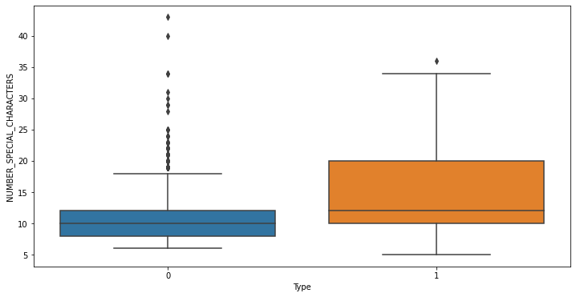
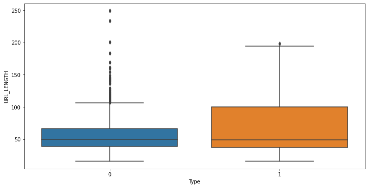
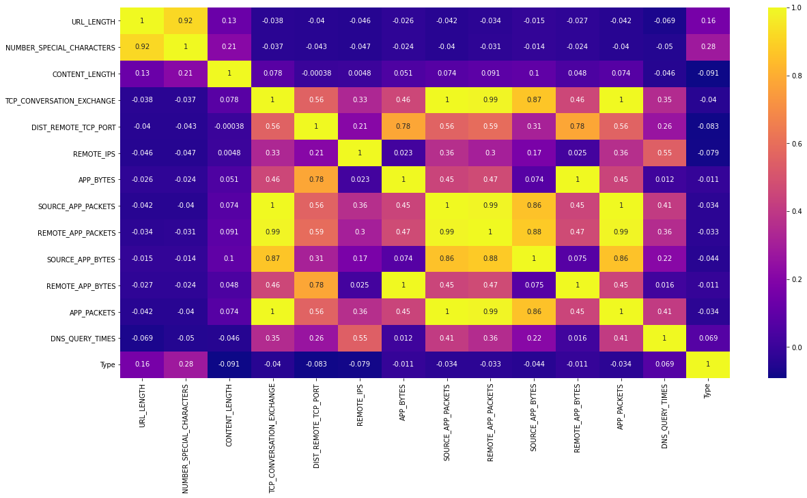
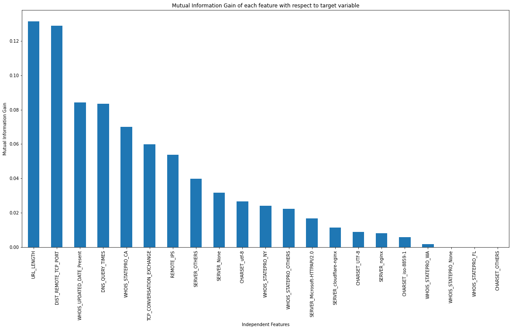

## AIM:
The objective is to classify Malicious (Type=1) websites from Benign (Type=0) ones on the basis of various features given in the dataset.<br>
Target variable: `"TYPE"`

## Features:
`URL`: it is the anonimous identification of the URL analyzed in the study <br>
`URL_LENGTH`: it is the number of characters in the URL <br>
`NUMBERSPECIALCHARACTERS`: it is number of special characters identified in the URL, such as, “/”, “%”, “#”, “&”, “. “, “=” <br>
`CHARSET`: it is a categorical value and its meaning is the character encoding standard (also called character set). <br>
`SERVER`: it is a categorical value and its meaning is the operative system of the server got from the packet response. <br>
`CONTENT_LENGTH`: it represents the content size of the HTTP header. <br>
`WHOIS_COUNTRY`: it is a categorical variable, its values are the countries we got from the server response (specifically, our script used the API of Whois). <br>
`WHOIS_STATEPRO`: it is a categorical variable, its values are the states we got from the server response (specifically, our script used the API of Whois). <br>
`WHOIS_REGDATE`: Whois provides the server registration date, so, this variable has date values with format DD/MM/YYY HH:MM <br>
`WHOISUPDATEDDATE`: Through the Whois we got the last update date from the server analyzed <br>
`TCPCONVERSATIONEXCHANGE`: This variable is the number of TCP packets exchanged between the server and our honeypot client <br>
`DISTREMOTETCP_PORT`: it is the number of the ports detected and different to TCP <br>
`REMOTE_IPS`: this variable has the total number of IPs connected to the honeypot <br>
`APP_BYTES`: this is the number of bytes transfered <br>
`SOURCEAPPPACKETS`: packets sent from the honeypot to the server <br>
`REMOTEAPPPACKETS`: packets received from the server <br>
`APP_PACKETS`: this is the total number of IP packets generated during the communication between the honeypot and the server <br>
`DNSQUERYTIMES`: this is the number of DNS packets generated during the communication between the honeypot and the server <br>
`TYPE`: this is a categorical variable, its values represent the type of web page analyzed, specifically, 1 is for malicious websites and 0 is for benign websites <br>

## Approach:
1) Explore the data <br>
2) Clean the relevant data <br>
3) Check imbalances (if any) <br>
4) Use resampling technqiues to resolve imbalances <br>
5) Feature Engineering and Feature Selection <br>
6) Try and finalize a Machine Learning Model <br>
7) Validate our results on Cross-Validation set <br>
8) Final Inferences and Conclusion <br>

#### Importing the required packages and dataset


```python
import numpy as np
import pandas as pd
import matplotlib.pyplot as plt
import seaborn as sns
```


```python
df = pd.read_csv("train.csv") # importing the dataset
```


```python
df.head() # checking the head
```


<div>
<style scoped>
    .dataframe tbody tr th:only-of-type {
        vertical-align: middle;
    }

    .dataframe tbody tr th {
        vertical-align: top;
    }

    .dataframe thead th {
        text-align: right;
    }
</style>
<table border="1" class="dataframe">
  <thead>
    <tr style="text-align: right;">
      <th></th>
      <th>URL</th>
      <th>URL_LENGTH</th>
      <th>NUMBER_SPECIAL_CHARACTERS</th>
      <th>CHARSET</th>
      <th>SERVER</th>
      <th>CONTENT_LENGTH</th>
      <th>WHOIS_COUNTRY</th>
      <th>WHOIS_STATEPRO</th>
      <th>WHOIS_REGDATE</th>
      <th>WHOIS_UPDATED_DATE</th>
      <th>...</th>
      <th>DIST_REMOTE_TCP_PORT</th>
      <th>REMOTE_IPS</th>
      <th>APP_BYTES</th>
      <th>SOURCE_APP_PACKETS</th>
      <th>REMOTE_APP_PACKETS</th>
      <th>SOURCE_APP_BYTES</th>
      <th>REMOTE_APP_BYTES</th>
      <th>APP_PACKETS</th>
      <th>DNS_QUERY_TIMES</th>
      <th>Type</th>
    </tr>
  </thead>
  <tbody>
    <tr>
      <th>0</th>
      <td>M0_109</td>
      <td>16</td>
      <td>7</td>
      <td>iso-8859-1</td>
      <td>nginx</td>
      <td>263.0</td>
      <td>None</td>
      <td>None</td>
      <td>10/10/2015 18:21</td>
      <td>None</td>
      <td>...</td>
      <td>0</td>
      <td>2</td>
      <td>700</td>
      <td>9</td>
      <td>10</td>
      <td>1153</td>
      <td>832</td>
      <td>9</td>
      <td>2.0</td>
      <td>1</td>
    </tr>
    <tr>
      <th>1</th>
      <td>B0_2314</td>
      <td>16</td>
      <td>6</td>
      <td>UTF-8</td>
      <td>Apache/2.4.10</td>
      <td>15087.0</td>
      <td>None</td>
      <td>None</td>
      <td>None</td>
      <td>None</td>
      <td>...</td>
      <td>7</td>
      <td>4</td>
      <td>1230</td>
      <td>17</td>
      <td>19</td>
      <td>1265</td>
      <td>1230</td>
      <td>17</td>
      <td>0.0</td>
      <td>0</td>
    </tr>
    <tr>
      <th>2</th>
      <td>B0_911</td>
      <td>16</td>
      <td>6</td>
      <td>us-ascii</td>
      <td>Microsoft-HTTPAPI/2.0</td>
      <td>324.0</td>
      <td>None</td>
      <td>None</td>
      <td>None</td>
      <td>None</td>
      <td>...</td>
      <td>0</td>
      <td>0</td>
      <td>0</td>
      <td>0</td>
      <td>0</td>
      <td>0</td>
      <td>0</td>
      <td>0</td>
      <td>0.0</td>
      <td>0</td>
    </tr>
    <tr>
      <th>3</th>
      <td>B0_113</td>
      <td>17</td>
      <td>6</td>
      <td>ISO-8859-1</td>
      <td>nginx</td>
      <td>162.0</td>
      <td>US</td>
      <td>AK</td>
      <td>7/10/1997 4:00</td>
      <td>12/09/2013 0:45</td>
      <td>...</td>
      <td>22</td>
      <td>3</td>
      <td>3812</td>
      <td>39</td>
      <td>37</td>
      <td>18784</td>
      <td>4380</td>
      <td>39</td>
      <td>8.0</td>
      <td>0</td>
    </tr>
    <tr>
      <th>4</th>
      <td>B0_403</td>
      <td>17</td>
      <td>6</td>
      <td>UTF-8</td>
      <td>None</td>
      <td>124140.0</td>
      <td>US</td>
      <td>TX</td>
      <td>12/05/1996 0:00</td>
      <td>11/04/2017 0:00</td>
      <td>...</td>
      <td>2</td>
      <td>5</td>
      <td>4278</td>
      <td>61</td>
      <td>62</td>
      <td>129889</td>
      <td>4586</td>
      <td>61</td>
      <td>4.0</td>
      <td>0</td>
    </tr>
  </tbody>
</table>
<p>5 rows × 21 columns</p>
</div>


```python
df.info() # checking the info
```

    <class 'pandas.core.frame.DataFrame'>
    RangeIndex: 1781 entries, 0 to 1780
    Data columns (total 21 columns):
     #   Column                     Non-Null Count  Dtype  
    ---  ------                     --------------  -----  
     0   URL                        1781 non-null   object 
     1   URL_LENGTH                 1781 non-null   int64  
     2   NUMBER_SPECIAL_CHARACTERS  1781 non-null   int64  
     3   CHARSET                    1781 non-null   object 
     4   SERVER                     1780 non-null   object 
     5   CONTENT_LENGTH             969 non-null    float64
     6   WHOIS_COUNTRY              1781 non-null   object 
     7   WHOIS_STATEPRO             1781 non-null   object 
     8   WHOIS_REGDATE              1781 non-null   object 
     9   WHOIS_UPDATED_DATE         1781 non-null   object 
     10  TCP_CONVERSATION_EXCHANGE  1781 non-null   int64  
     11  DIST_REMOTE_TCP_PORT       1781 non-null   int64  
     12  REMOTE_IPS                 1781 non-null   int64  
     13  APP_BYTES                  1781 non-null   int64  
     14  SOURCE_APP_PACKETS         1781 non-null   int64  
     15  REMOTE_APP_PACKETS         1781 non-null   int64  
     16  SOURCE_APP_BYTES           1781 non-null   int64  
     17  REMOTE_APP_BYTES           1781 non-null   int64  
     18  APP_PACKETS                1781 non-null   int64  
     19  DNS_QUERY_TIMES            1780 non-null   float64
     20  Type                       1781 non-null   int64  
    dtypes: float64(2), int64(12), object(7)
    memory usage: 292.3+ KB
    


```python
df.isna().sum() # Checking the missing values per column
```


    URL                            0
    URL_LENGTH                     0
    NUMBER_SPECIAL_CHARACTERS      0
    CHARSET                        0
    SERVER                         1
    CONTENT_LENGTH               812
    WHOIS_COUNTRY                  0
    WHOIS_STATEPRO                 0
    WHOIS_REGDATE                  0
    WHOIS_UPDATED_DATE             0
    TCP_CONVERSATION_EXCHANGE      0
    DIST_REMOTE_TCP_PORT           0
    REMOTE_IPS                     0
    APP_BYTES                      0
    SOURCE_APP_PACKETS             0
    REMOTE_APP_PACKETS             0
    SOURCE_APP_BYTES               0
    REMOTE_APP_BYTES               0
    APP_PACKETS                    0
    DNS_QUERY_TIMES                1
    Type                           0
    dtype: int64


#### Checking the imbalance in target variable


```python
100 * df['Type'].value_counts()/len(df)
```


    0    87.871982
    1    12.128018
    Name: Type, dtype: float64


There is a high imbalance towards Type=0 class. The ratio is around 88%-12%. We'll fix this later using SMOTE.

## Exploratory Data Analysis (EDA)


```python
df.describe() # checking the descriptive stats for each numerical feature
```


<div>
<style scoped>
    .dataframe tbody tr th:only-of-type {
        vertical-align: middle;
    }

    .dataframe tbody tr th {
        vertical-align: top;
    }

    .dataframe thead th {
        text-align: right;
    }
</style>
<table border="1" class="dataframe">
  <thead>
    <tr style="text-align: right;">
      <th></th>
      <th>URL_LENGTH</th>
      <th>NUMBER_SPECIAL_CHARACTERS</th>
      <th>CONTENT_LENGTH</th>
      <th>TCP_CONVERSATION_EXCHANGE</th>
      <th>DIST_REMOTE_TCP_PORT</th>
      <th>REMOTE_IPS</th>
      <th>APP_BYTES</th>
      <th>SOURCE_APP_PACKETS</th>
      <th>REMOTE_APP_PACKETS</th>
      <th>SOURCE_APP_BYTES</th>
      <th>REMOTE_APP_BYTES</th>
      <th>APP_PACKETS</th>
      <th>DNS_QUERY_TIMES</th>
      <th>Type</th>
    </tr>
  </thead>
  <tbody>
    <tr>
      <th>count</th>
      <td>1781.000000</td>
      <td>1781.000000</td>
      <td>969.000000</td>
      <td>1781.000000</td>
      <td>1781.000000</td>
      <td>1781.000000</td>
      <td>1.781000e+03</td>
      <td>1781.000000</td>
      <td>1781.000000</td>
      <td>1.781000e+03</td>
      <td>1.781000e+03</td>
      <td>1781.000000</td>
      <td>1780.000000</td>
      <td>1781.000000</td>
    </tr>
    <tr>
      <th>mean</th>
      <td>56.961258</td>
      <td>11.111735</td>
      <td>11726.927761</td>
      <td>16.261089</td>
      <td>5.472768</td>
      <td>3.060640</td>
      <td>2.982339e+03</td>
      <td>18.540146</td>
      <td>18.746210</td>
      <td>1.589255e+04</td>
      <td>3.155599e+03</td>
      <td>18.540146</td>
      <td>2.263483</td>
      <td>0.121280</td>
    </tr>
    <tr>
      <th>std</th>
      <td>27.555586</td>
      <td>4.549896</td>
      <td>36391.809051</td>
      <td>40.500975</td>
      <td>21.807327</td>
      <td>3.386975</td>
      <td>5.605057e+04</td>
      <td>41.627173</td>
      <td>46.397969</td>
      <td>6.986193e+04</td>
      <td>5.605378e+04</td>
      <td>41.627173</td>
      <td>2.930853</td>
      <td>0.326544</td>
    </tr>
    <tr>
      <th>min</th>
      <td>16.000000</td>
      <td>5.000000</td>
      <td>0.000000</td>
      <td>0.000000</td>
      <td>0.000000</td>
      <td>0.000000</td>
      <td>0.000000e+00</td>
      <td>0.000000</td>
      <td>0.000000</td>
      <td>0.000000e+00</td>
      <td>0.000000e+00</td>
      <td>0.000000</td>
      <td>0.000000</td>
      <td>0.000000</td>
    </tr>
    <tr>
      <th>25%</th>
      <td>39.000000</td>
      <td>8.000000</td>
      <td>324.000000</td>
      <td>0.000000</td>
      <td>0.000000</td>
      <td>0.000000</td>
      <td>0.000000e+00</td>
      <td>0.000000</td>
      <td>0.000000</td>
      <td>0.000000e+00</td>
      <td>0.000000e+00</td>
      <td>0.000000</td>
      <td>0.000000</td>
      <td>0.000000</td>
    </tr>
    <tr>
      <th>50%</th>
      <td>49.000000</td>
      <td>10.000000</td>
      <td>1853.000000</td>
      <td>7.000000</td>
      <td>0.000000</td>
      <td>2.000000</td>
      <td>6.720000e+02</td>
      <td>8.000000</td>
      <td>9.000000</td>
      <td>5.790000e+02</td>
      <td>7.350000e+02</td>
      <td>8.000000</td>
      <td>0.000000</td>
      <td>0.000000</td>
    </tr>
    <tr>
      <th>75%</th>
      <td>68.000000</td>
      <td>13.000000</td>
      <td>11323.000000</td>
      <td>22.000000</td>
      <td>5.000000</td>
      <td>5.000000</td>
      <td>2.328000e+03</td>
      <td>26.000000</td>
      <td>25.000000</td>
      <td>9.806000e+03</td>
      <td>2.701000e+03</td>
      <td>26.000000</td>
      <td>4.000000</td>
      <td>0.000000</td>
    </tr>
    <tr>
      <th>max</th>
      <td>249.000000</td>
      <td>43.000000</td>
      <td>649263.000000</td>
      <td>1194.000000</td>
      <td>708.000000</td>
      <td>17.000000</td>
      <td>2.362906e+06</td>
      <td>1198.000000</td>
      <td>1284.000000</td>
      <td>2.060012e+06</td>
      <td>2.362906e+06</td>
      <td>1198.000000</td>
      <td>20.000000</td>
      <td>1.000000</td>
    </tr>
  </tbody>
</table>
</div>


### Now let's try finding any trend of other features with respect to Target variables

### 1) Type vs Number of special characters


```python
plt.figure(figsize=(12,6))
sns.boxplot(data=df,x='Type',y='NUMBER_SPECIAL_CHARACTERS');
```


    

    


### Inference: 
The number of special characters for Malicious website is higher than benign ones.

### 2) Type vs URL length


```python
plt.figure(figsize=(12,6))
sns.boxplot(data=df,x='Type',y='URL_LENGTH');
```


    

    


#### Inference:
The mean length of URL is higher for Malicious website as compared to benign ones.


```python

```

## Let's do a bit of Data processing and then continue with EDA

#### Let's see how many unique categories are there in each categorical column


```python
for i in df.select_dtypes(include='object').columns:
    print(f"{i} -> {df[i].nunique()}")
```

    URL -> 1781
    CHARSET -> 9
    SERVER -> 239
    WHOIS_COUNTRY -> 49
    WHOIS_STATEPRO -> 182
    WHOIS_REGDATE -> 891
    WHOIS_UPDATED_DATE -> 594
    

#### Let's create some custom functions to only keep top 5 category in each categorical column and then applying these function to their respective columns


```python
df['CHARSET'].value_counts()
```


    UTF-8           676
    ISO-8859-1      427
    utf-8           379
    us-ascii        155
    iso-8859-1      134
    None              7
    windows-1252      1
    windows-1251      1
    ISO-8859          1
    Name: CHARSET, dtype: int64


```python
def CHARSET_CLEANER(x):
    if x not in ['UTF-8','ISO-8859-1','utf-8','us-ascii','iso-8859-1']:
        return "OTHERS"
    else:
        return x
```


```python
df['CHARSET'] = df['CHARSET'].apply(CHARSET_CLEANER)
```


```python
df['CHARSET'].value_counts()
```


    UTF-8         676
    ISO-8859-1    427
    utf-8         379
    us-ascii      155
    iso-8859-1    134
    OTHERS         10
    Name: CHARSET, dtype: int64


```python
df['SERVER'].value_counts()
```


    Apache                                                                        386
    nginx                                                                         211
    None                                                                          175
    Microsoft-HTTPAPI/2.0                                                         113
    cloudflare-nginx                                                               94
                                                                                 ... 
    Apache/2.4.10 (Ubuntu)                                                          1
    Apache/1.3.34 (Unix) PHP/4.4.4                                                  1
    Apache/2.4.6 (Unix) mod_jk/1.2.37 PHP/5.5.1 OpenSSL/1.0.1g mod_fcgid/2.3.9      1
    mw2180.codfw.wmnet                                                              1
    DPS/1.1.8                                                                       1
    Name: SERVER, Length: 239, dtype: int64


```python
def SERVER_CLEANER(x):
    if x not in ['Apache','nginx','None','Microsoft-HTTPAPI/2.0','cloudflare-nginx']:
        return "OTHERS"
    else:
        return x
```


```python
df['SERVER'] = df['SERVER'].apply(SERVER_CLEANER)
```


```python
df['SERVER'].value_counts()
```


    OTHERS                   802
    Apache                   386
    nginx                    211
    None                     175
    Microsoft-HTTPAPI/2.0    113
    cloudflare-nginx          94
    Name: SERVER, dtype: int64


```python
df['WHOIS_STATEPRO'].value_counts()[:7]
```


    CA           372
    None         362
    NY            75
    WA            65
    Barcelona     62
    FL            61
    Arizona       58
    Name: WHOIS_STATEPRO, dtype: int64


```python
def STATE_CLEANER(x):
    if x not in ['CA','None','NY','WA','Barcelona','FL']:
        return "OTHERS"
    else:
        return x
```


```python
df['WHOIS_STATEPRO'] = df['WHOIS_STATEPRO'].apply(STATE_CLEANER)
```


```python
df['WHOIS_STATEPRO'].value_counts()
```


    OTHERS       784
    CA           372
    None         362
    NY            75
    WA            65
    Barcelona     62
    FL            61
    Name: WHOIS_STATEPRO, dtype: int64


```python
def DATE_CLEANER(x):
    if x == 'None':
        return "Absent"
    else:
        return "Present"
```


```python
df['WHOIS_REGDATE'] = df['WHOIS_REGDATE'].apply(DATE_CLEANER)
```


```python
df['WHOIS_UPDATED_DATE'] = df['WHOIS_UPDATED_DATE'].apply(DATE_CLEANER)
```


```python
df.head()
```


<div>
<style scoped>
    .dataframe tbody tr th:only-of-type {
        vertical-align: middle;
    }

    .dataframe tbody tr th {
        vertical-align: top;
    }

    .dataframe thead th {
        text-align: right;
    }
</style>
<table border="1" class="dataframe">
  <thead>
    <tr style="text-align: right;">
      <th></th>
      <th>URL</th>
      <th>URL_LENGTH</th>
      <th>NUMBER_SPECIAL_CHARACTERS</th>
      <th>CHARSET</th>
      <th>SERVER</th>
      <th>CONTENT_LENGTH</th>
      <th>WHOIS_COUNTRY</th>
      <th>WHOIS_STATEPRO</th>
      <th>WHOIS_REGDATE</th>
      <th>WHOIS_UPDATED_DATE</th>
      <th>...</th>
      <th>DIST_REMOTE_TCP_PORT</th>
      <th>REMOTE_IPS</th>
      <th>APP_BYTES</th>
      <th>SOURCE_APP_PACKETS</th>
      <th>REMOTE_APP_PACKETS</th>
      <th>SOURCE_APP_BYTES</th>
      <th>REMOTE_APP_BYTES</th>
      <th>APP_PACKETS</th>
      <th>DNS_QUERY_TIMES</th>
      <th>Type</th>
    </tr>
  </thead>
  <tbody>
    <tr>
      <th>0</th>
      <td>M0_109</td>
      <td>16</td>
      <td>7</td>
      <td>iso-8859-1</td>
      <td>nginx</td>
      <td>263.0</td>
      <td>None</td>
      <td>None</td>
      <td>Present</td>
      <td>Absent</td>
      <td>...</td>
      <td>0</td>
      <td>2</td>
      <td>700</td>
      <td>9</td>
      <td>10</td>
      <td>1153</td>
      <td>832</td>
      <td>9</td>
      <td>2.0</td>
      <td>1</td>
    </tr>
    <tr>
      <th>1</th>
      <td>B0_2314</td>
      <td>16</td>
      <td>6</td>
      <td>UTF-8</td>
      <td>OTHERS</td>
      <td>15087.0</td>
      <td>None</td>
      <td>None</td>
      <td>Absent</td>
      <td>Absent</td>
      <td>...</td>
      <td>7</td>
      <td>4</td>
      <td>1230</td>
      <td>17</td>
      <td>19</td>
      <td>1265</td>
      <td>1230</td>
      <td>17</td>
      <td>0.0</td>
      <td>0</td>
    </tr>
    <tr>
      <th>2</th>
      <td>B0_911</td>
      <td>16</td>
      <td>6</td>
      <td>us-ascii</td>
      <td>Microsoft-HTTPAPI/2.0</td>
      <td>324.0</td>
      <td>None</td>
      <td>None</td>
      <td>Absent</td>
      <td>Absent</td>
      <td>...</td>
      <td>0</td>
      <td>0</td>
      <td>0</td>
      <td>0</td>
      <td>0</td>
      <td>0</td>
      <td>0</td>
      <td>0</td>
      <td>0.0</td>
      <td>0</td>
    </tr>
    <tr>
      <th>3</th>
      <td>B0_113</td>
      <td>17</td>
      <td>6</td>
      <td>ISO-8859-1</td>
      <td>nginx</td>
      <td>162.0</td>
      <td>US</td>
      <td>OTHERS</td>
      <td>Present</td>
      <td>Present</td>
      <td>...</td>
      <td>22</td>
      <td>3</td>
      <td>3812</td>
      <td>39</td>
      <td>37</td>
      <td>18784</td>
      <td>4380</td>
      <td>39</td>
      <td>8.0</td>
      <td>0</td>
    </tr>
    <tr>
      <th>4</th>
      <td>B0_403</td>
      <td>17</td>
      <td>6</td>
      <td>UTF-8</td>
      <td>None</td>
      <td>124140.0</td>
      <td>US</td>
      <td>OTHERS</td>
      <td>Present</td>
      <td>Present</td>
      <td>...</td>
      <td>2</td>
      <td>5</td>
      <td>4278</td>
      <td>61</td>
      <td>62</td>
      <td>129889</td>
      <td>4586</td>
      <td>61</td>
      <td>4.0</td>
      <td>0</td>
    </tr>
  </tbody>
</table>
<p>5 rows × 21 columns</p>
</div>


```python
df.drop(['URL','WHOIS_COUNTRY'],axis=1,inplace=True)
```


```python
df.head()
```


<div>
<style scoped>
    .dataframe tbody tr th:only-of-type {
        vertical-align: middle;
    }

    .dataframe tbody tr th {
        vertical-align: top;
    }

    .dataframe thead th {
        text-align: right;
    }
</style>
<table border="1" class="dataframe">
  <thead>
    <tr style="text-align: right;">
      <th></th>
      <th>URL_LENGTH</th>
      <th>NUMBER_SPECIAL_CHARACTERS</th>
      <th>CHARSET</th>
      <th>SERVER</th>
      <th>CONTENT_LENGTH</th>
      <th>WHOIS_STATEPRO</th>
      <th>WHOIS_REGDATE</th>
      <th>WHOIS_UPDATED_DATE</th>
      <th>TCP_CONVERSATION_EXCHANGE</th>
      <th>DIST_REMOTE_TCP_PORT</th>
      <th>REMOTE_IPS</th>
      <th>APP_BYTES</th>
      <th>SOURCE_APP_PACKETS</th>
      <th>REMOTE_APP_PACKETS</th>
      <th>SOURCE_APP_BYTES</th>
      <th>REMOTE_APP_BYTES</th>
      <th>APP_PACKETS</th>
      <th>DNS_QUERY_TIMES</th>
      <th>Type</th>
    </tr>
  </thead>
  <tbody>
    <tr>
      <th>0</th>
      <td>16</td>
      <td>7</td>
      <td>iso-8859-1</td>
      <td>nginx</td>
      <td>263.0</td>
      <td>None</td>
      <td>Present</td>
      <td>Absent</td>
      <td>7</td>
      <td>0</td>
      <td>2</td>
      <td>700</td>
      <td>9</td>
      <td>10</td>
      <td>1153</td>
      <td>832</td>
      <td>9</td>
      <td>2.0</td>
      <td>1</td>
    </tr>
    <tr>
      <th>1</th>
      <td>16</td>
      <td>6</td>
      <td>UTF-8</td>
      <td>OTHERS</td>
      <td>15087.0</td>
      <td>None</td>
      <td>Absent</td>
      <td>Absent</td>
      <td>17</td>
      <td>7</td>
      <td>4</td>
      <td>1230</td>
      <td>17</td>
      <td>19</td>
      <td>1265</td>
      <td>1230</td>
      <td>17</td>
      <td>0.0</td>
      <td>0</td>
    </tr>
    <tr>
      <th>2</th>
      <td>16</td>
      <td>6</td>
      <td>us-ascii</td>
      <td>Microsoft-HTTPAPI/2.0</td>
      <td>324.0</td>
      <td>None</td>
      <td>Absent</td>
      <td>Absent</td>
      <td>0</td>
      <td>0</td>
      <td>0</td>
      <td>0</td>
      <td>0</td>
      <td>0</td>
      <td>0</td>
      <td>0</td>
      <td>0</td>
      <td>0.0</td>
      <td>0</td>
    </tr>
    <tr>
      <th>3</th>
      <td>17</td>
      <td>6</td>
      <td>ISO-8859-1</td>
      <td>nginx</td>
      <td>162.0</td>
      <td>OTHERS</td>
      <td>Present</td>
      <td>Present</td>
      <td>31</td>
      <td>22</td>
      <td>3</td>
      <td>3812</td>
      <td>39</td>
      <td>37</td>
      <td>18784</td>
      <td>4380</td>
      <td>39</td>
      <td>8.0</td>
      <td>0</td>
    </tr>
    <tr>
      <th>4</th>
      <td>17</td>
      <td>6</td>
      <td>UTF-8</td>
      <td>None</td>
      <td>124140.0</td>
      <td>OTHERS</td>
      <td>Present</td>
      <td>Present</td>
      <td>57</td>
      <td>2</td>
      <td>5</td>
      <td>4278</td>
      <td>61</td>
      <td>62</td>
      <td>129889</td>
      <td>4586</td>
      <td>61</td>
      <td>4.0</td>
      <td>0</td>
    </tr>
  </tbody>
</table>
</div>


## EDA continued

### 3) Correlation Heat map


```python
plt.figure(figsize=(20,10))
sns.heatmap(data=df.corr(),cmap='plasma',annot=True)
```


    <AxesSubplot:>


    

    


#### Although we can see some highly correlated features, it won't be wise to remove them all as that could lead us to significant loss in drawing out inferences. Hence, we'll only remove those columns which won;t have much impact on analysis and frther modelling

#### Since Content Length is not significantly correlated with any of the features and also contains a lot of missing values. It would be good if we drop it out.


```python
df2 = df.copy() # creating a copy of our dataframe
```


```python
df2.drop("CONTENT_LENGTH",axis=1,inplace=True) # dropping the column which is not required
```

## Feature Engineering and Feature Selection

#### Changing categorical column into dummies


```python
df3 = df2.copy() # creating a copy of the dataframe
```


```python
df3 = pd.get_dummies(df3,columns=['WHOIS_UPDATED_DATE','WHOIS_REGDATE','WHOIS_STATEPRO','SERVER','CHARSET'],drop_first=True) # creating dummies
```


```python
df3.head() # checking the head
```


<div>
<style scoped>
    .dataframe tbody tr th:only-of-type {
        vertical-align: middle;
    }

    .dataframe tbody tr th {
        vertical-align: top;
    }

    .dataframe thead th {
        text-align: right;
    }
</style>
<table border="1" class="dataframe">
  <thead>
    <tr style="text-align: right;">
      <th></th>
      <th>URL_LENGTH</th>
      <th>NUMBER_SPECIAL_CHARACTERS</th>
      <th>TCP_CONVERSATION_EXCHANGE</th>
      <th>DIST_REMOTE_TCP_PORT</th>
      <th>REMOTE_IPS</th>
      <th>APP_BYTES</th>
      <th>SOURCE_APP_PACKETS</th>
      <th>REMOTE_APP_PACKETS</th>
      <th>SOURCE_APP_BYTES</th>
      <th>REMOTE_APP_BYTES</th>
      <th>...</th>
      <th>SERVER_Microsoft-HTTPAPI/2.0</th>
      <th>SERVER_None</th>
      <th>SERVER_OTHERS</th>
      <th>SERVER_cloudflare-nginx</th>
      <th>SERVER_nginx</th>
      <th>CHARSET_OTHERS</th>
      <th>CHARSET_UTF-8</th>
      <th>CHARSET_iso-8859-1</th>
      <th>CHARSET_us-ascii</th>
      <th>CHARSET_utf-8</th>
    </tr>
  </thead>
  <tbody>
    <tr>
      <th>0</th>
      <td>16</td>
      <td>7</td>
      <td>7</td>
      <td>0</td>
      <td>2</td>
      <td>700</td>
      <td>9</td>
      <td>10</td>
      <td>1153</td>
      <td>832</td>
      <td>...</td>
      <td>0</td>
      <td>0</td>
      <td>0</td>
      <td>0</td>
      <td>1</td>
      <td>0</td>
      <td>0</td>
      <td>1</td>
      <td>0</td>
      <td>0</td>
    </tr>
    <tr>
      <th>1</th>
      <td>16</td>
      <td>6</td>
      <td>17</td>
      <td>7</td>
      <td>4</td>
      <td>1230</td>
      <td>17</td>
      <td>19</td>
      <td>1265</td>
      <td>1230</td>
      <td>...</td>
      <td>0</td>
      <td>0</td>
      <td>1</td>
      <td>0</td>
      <td>0</td>
      <td>0</td>
      <td>1</td>
      <td>0</td>
      <td>0</td>
      <td>0</td>
    </tr>
    <tr>
      <th>2</th>
      <td>16</td>
      <td>6</td>
      <td>0</td>
      <td>0</td>
      <td>0</td>
      <td>0</td>
      <td>0</td>
      <td>0</td>
      <td>0</td>
      <td>0</td>
      <td>...</td>
      <td>1</td>
      <td>0</td>
      <td>0</td>
      <td>0</td>
      <td>0</td>
      <td>0</td>
      <td>0</td>
      <td>0</td>
      <td>1</td>
      <td>0</td>
    </tr>
    <tr>
      <th>3</th>
      <td>17</td>
      <td>6</td>
      <td>31</td>
      <td>22</td>
      <td>3</td>
      <td>3812</td>
      <td>39</td>
      <td>37</td>
      <td>18784</td>
      <td>4380</td>
      <td>...</td>
      <td>0</td>
      <td>0</td>
      <td>0</td>
      <td>0</td>
      <td>1</td>
      <td>0</td>
      <td>0</td>
      <td>0</td>
      <td>0</td>
      <td>0</td>
    </tr>
    <tr>
      <th>4</th>
      <td>17</td>
      <td>6</td>
      <td>57</td>
      <td>2</td>
      <td>5</td>
      <td>4278</td>
      <td>61</td>
      <td>62</td>
      <td>129889</td>
      <td>4586</td>
      <td>...</td>
      <td>0</td>
      <td>1</td>
      <td>0</td>
      <td>0</td>
      <td>0</td>
      <td>0</td>
      <td>1</td>
      <td>0</td>
      <td>0</td>
      <td>0</td>
    </tr>
  </tbody>
</table>
<p>5 rows × 31 columns</p>
</div>


```python
df3.isna().sum() # checking for any missing value
```


    URL_LENGTH                      0
    NUMBER_SPECIAL_CHARACTERS       0
    TCP_CONVERSATION_EXCHANGE       0
    DIST_REMOTE_TCP_PORT            0
    REMOTE_IPS                      0
    APP_BYTES                       0
    SOURCE_APP_PACKETS              0
    REMOTE_APP_PACKETS              0
    SOURCE_APP_BYTES                0
    REMOTE_APP_BYTES                0
    APP_PACKETS                     0
    DNS_QUERY_TIMES                 1
    Type                            0
    WHOIS_UPDATED_DATE_Present      0
    WHOIS_REGDATE_Present           0
    WHOIS_STATEPRO_CA               0
    WHOIS_STATEPRO_FL               0
    WHOIS_STATEPRO_NY               0
    WHOIS_STATEPRO_None             0
    WHOIS_STATEPRO_OTHERS           0
    WHOIS_STATEPRO_WA               0
    SERVER_Microsoft-HTTPAPI/2.0    0
    SERVER_None                     0
    SERVER_OTHERS                   0
    SERVER_cloudflare-nginx         0
    SERVER_nginx                    0
    CHARSET_OTHERS                  0
    CHARSET_UTF-8                   0
    CHARSET_iso-8859-1              0
    CHARSET_us-ascii                0
    CHARSET_utf-8                   0
    dtype: int64


```python
df3.dropna(inplace=True) # dropping all the missing values
```

### Using SMOTE to extrapolate our model

`About SMOTE`: Synthetic Minority Oversampling Technique (SMOTE) is a resampling technique which oversamples the minority class by "synthesizing" various parameters and creating new data points by using various "data augmentation" techniques. By this, we get enough numbers of minority class data points to sufficiently carry out the learning processes for the ML model. Hence, we avoid data duplication of minority class (which is the case in oversampling).  


```python
# Importing the SMOTE function
from imblearn.over_sampling import SMOTE
```


```python
# Creating the set of independent features and target variable
X = df3.drop("Type",axis=1)
y = df3['Type']
```


```python
from imblearn.under_sampling import RandomUnderSampler  # importing the Under Sampling function
```


```python
# We shall keep undersampled majority class 50% more than the oversampled minority class. 
# This is being done on order to resemble the composition of original dataframe in the SMOTE's dataframe
undersample = RandomUnderSampler(sampling_strategy=0.5) 
```


```python
from imblearn.pipeline import Pipeline # Importing the pipeline
```


```python
# Initializing the SMOTE function. We set our SMOTE function to oversample the minority to the number equal to the majority class. 
#Then, we take 50% of the oversampled minority class (randomly sampled).
oversample = SMOTE(sampling_strategy=0.5) 
```


```python
steps = [('o',oversample),('u',undersample)] # steps for pipelining. First "do oversampling of the minority class" and then do "undersampling of the majority class"
```


```python
pipeline = Pipeline(steps=steps) # Creating the pipeline instance
```


```python
X_smote, y_smote = pipeline.fit_resample(X,y) # Fitting the pipeline to our dataset
```


```python
y_smote.value_counts() # Taking value counts of the targte feature
```


    0    1564
    1     782
    Name: Type, dtype: int64


```python
len(X_smote) # checking the total number of samples we have
```


    2346


```python
X_smote.shape # checking the shape
```


    (2346, 30)


### SMOTE has been implemented. Now, we'll start the modelling by first creating a hold-out train and test set and then using stratified cross validation to cover all possibilities


```python
from sklearn.model_selection import train_test_split,StratifiedKFold,cross_val_score,cross_validate  # Implementing the required functions
```


```python
X_train, X_test, y_train, y_test = train_test_split(X, y, test_size=0.2, random_state=42) # creating a test holdout set
```


```python
from sklearn.preprocessing import StandardScaler # import the standard scaling function
```


```python
sc = StandardScaler() # creating an instance of the scaling function
```


```python
X_train = sc.fit_transform(X_train) # fitting and transform the training set
X_test = sc.transform(X_test) # just transforming the testing set to avoid 'data leakage'
```


```python
from sklearn.metrics import confusion_matrix,classification_report,accuracy_score,f1_score,fbeta_score,make_scorer,precision_score,recall_score 
# importing all the metric scores required for evaluation
```


```python
# creating a dictionary to evaluate metric over stratified k-fold cv
scoring = {'accuracy' : make_scorer(accuracy_score), 
           'precision' : make_scorer(precision_score),
           'recall' : make_scorer(recall_score), 
           'f1_score' : make_scorer(f1_score)}
```


```python

```

### We'll be using tree based ensemble models as they are immune to multicollinearity

### Note: We're interested in a model which has high recall as we want to minimize False Negative Rate at the same time keeping precision high as well. Hence, we need to find a `sweet spot` while evaluating our model

### 1) Random Forest


```python
from sklearn.ensemble import RandomForestClassifier # importing the function
```


```python
rf = RandomForestClassifier(n_estimators=100,criterion='entropy',random_state=42,class_weight={0:1,1:5},max_depth=5) # creating an instance
```


```python
rf.fit(X_train,y_train) # fitting the model
```


    RandomForestClassifier(class_weight={0: 1, 1: 5}, criterion='entropy',
                           max_depth=5, random_state=42)


```python
rf_cv_f1 = cross_validate(rf,X_test,y_test,cv=StratifiedKFold(n_splits=5,shuffle=True,random_state=111),scoring=scoring) 
# cross-validating our model over 5 folds and evaluting metrics are: accuracy, precision, recall and F-1 score
```


```python
print(f" ACCURACY: {rf_cv_f1['test_accuracy'].mean()}")
print(f" PRECISION: {rf_cv_f1['test_precision'].mean()}")
print(f" RECALL: {rf_cv_f1['test_recall'].mean()}")
print(f" F-1 Score: {rf_cv_f1['test_f1_score'].mean()}")
```

     ACCURACY: 0.8958528951486698
     PRECISION: 0.6437762237762238
     RECALL: 0.7872727272727272
     F-1 Score: 0.695487012987013
    


```python
rf_pred = rf.predict(X_test) # predicting on the hold out test set
```


```python
print(classification_report(y_test,rf_pred)) 
print(confusion_matrix(y_test,rf_pred))
```

                  precision    recall  f1-score   support
    
               0       0.98      0.93      0.95       304
               1       0.69      0.87      0.77        52
    
        accuracy                           0.92       356
       macro avg       0.83      0.90      0.86       356
    weighted avg       0.93      0.92      0.93       356
    
    [[284  20]
     [  7  45]]
    


```python

```

### 2) Catboost


```python
from catboost import CatBoostClassifier # importing the function
```


```python
cb = CatBoostClassifier(random_state=42,verbose=500,class_weights={0:1,1:5},max_depth=5,early_stopping_rounds=30,boosting_type='Ordered') # creating an instance
```


```python
cb.fit(X_train,y_train) # fitting the model
```

    Learning rate set to 0.011981
    0:	learn: 0.6756274	total: 155ms	remaining: 2m 34s
    500:	learn: 0.1157566	total: 3.83s	remaining: 3.81s
    999:	learn: 0.0604226	total: 7.52s	remaining: 0us
    


    <catboost.core.CatBoostClassifier at 0x1e4dbafbc10>


```python
cb_cv_f1 = cross_validate(cb,X_test,y_test,cv=StratifiedKFold(n_splits=5,shuffle=True,random_state=42),scoring=scoring)
# cross-validating our model over 5 folds and evaluting metrics are: accuracy, precision, recall and F-1 score
```

    Learning rate set to 0.006019
    0:	learn: 0.6857393	total: 9.25ms	remaining: 9.24s
    500:	learn: 0.1806446	total: 3.62s	remaining: 3.6s
    999:	learn: 0.1018346	total: 7.14s	remaining: 0us
    Learning rate set to 0.006028
    0:	learn: 0.6866775	total: 6.18ms	remaining: 6.18s
    500:	learn: 0.1822175	total: 3.44s	remaining: 3.42s
    999:	learn: 0.1087319	total: 6.92s	remaining: 0us
    Learning rate set to 0.006028
    0:	learn: 0.6867839	total: 6.48ms	remaining: 6.47s
    500:	learn: 0.1680272	total: 3.69s	remaining: 3.67s
    999:	learn: 0.0988092	total: 7.54s	remaining: 0us
    Learning rate set to 0.006028
    0:	learn: 0.6867894	total: 6.71ms	remaining: 6.7s
    500:	learn: 0.1909167	total: 3.61s	remaining: 3.6s
    999:	learn: 0.1079882	total: 7.3s	remaining: 0us
    Learning rate set to 0.006028
    0:	learn: 0.6872671	total: 6.03ms	remaining: 6.02s
    500:	learn: 0.1850676	total: 3.55s	remaining: 3.53s
    999:	learn: 0.1092527	total: 7.36s	remaining: 0us
    


```python
print(f" ACCURACY: {cb_cv_f1['test_accuracy'].mean()}")
print(f" PRECISION: {cb_cv_f1['test_precision'].mean()}")
print(f" RECALL: {cb_cv_f1['test_recall'].mean()}")
print(f" F-1 Score: {cb_cv_f1['test_f1_score'].mean()}")
```

     ACCURACY: 0.901643192488263
     PRECISION: 0.636451969083548
     RECALL: 0.8272727272727272
     F-1 Score: 0.7126429512516469
    


```python
cb_pred = cb.predict(X_test) # predicting on the hold out test set
```


```python
print(classification_report(y_test,cb_pred))
print(confusion_matrix(y_test,cb_pred))
```

                  precision    recall  f1-score   support
    
               0       0.98      0.96      0.97       304
               1       0.79      0.87      0.83        52
    
        accuracy                           0.95       356
       macro avg       0.88      0.91      0.90       356
    weighted avg       0.95      0.95      0.95       356
    
    [[292  12]
     [  7  45]]
    


```python

```

### Catboost Classifier is the best optimal model for our data as it is quite robust, immune to multicollinearity and has high recall and F-1 score

### Knowing the dependence of target variable on various feature using Mutual Information Gain 

#### Mutual Information Gain:
MI Estimate mutual information for a discrete target variable.

Mutual information (MI) between two random variables is a non-negative value, which measures the dependency between the variables. It is equal to zero if and only if two random variables are independent, and higher values mean higher dependency. <br>

I(X ; Y) = H(X) – H(X | Y) Where I(X ; Y) is the mutual information for X and Y, H(X) is the entropy for X and H(X | Y) is the conditional entropy for X given Y. The result has the units of bits.

Credits: Krish Naik GitHub repository (Feature Selection) <br>
Link: https://github.com/krishnaik06/Complete-Feature-Selection/blob/master/3-%20Information%20gain%20-%20mutual%20information%20In%20Classification.ipynb

#### Before evaluating Mutual information gain, first let's remove those columns which are highly correlated, i.e. we'll first remove high multicollinearity.


```python
def correlation(dataset,threshold):
    col_corr = set() # empty set to avoid repittion later
    corr_matrix = dataset.corr()
    for i in range(len(corr_matrix.columns)):
        for j in range(i):
            if (corr_matrix.iloc[i,j]) > threshold: # abs is taken to consider highly negatively correlated columns as well
                colname = corr_matrix.columns[i] # getting the name of the column
                col_corr.add(colname)
    return col_corr
```


```python
correlation(X_smote,0.7) # all those columns which ahve more than 70% collinearity
```


    {'APP_BYTES',
     'APP_PACKETS',
     'CHARSET_us-ascii',
     'NUMBER_SPECIAL_CHARACTERS',
     'REMOTE_APP_BYTES',
     'REMOTE_APP_PACKETS',
     'SOURCE_APP_BYTES',
     'SOURCE_APP_PACKETS',
     'WHOIS_REGDATE_Present'}


```python
X_smote2 = X_smote.drop(list(correlation(X_smote,0.7)),axis=1) # removing all those columns which ahve more than 70% collinearity
```


```python
from sklearn.feature_selection import mutual_info_classif
# determine the mutual information
mutual_info = mutual_info_classif(X_smote2, y_smote)
mutual_info
```


    array([0.13144412, 0.0598977 , 0.12897923, 0.05382402, 0.08336961,
           0.08412617, 0.07001391, 0.        , 0.02407917, 0.        ,
           0.02230589, 0.00177543, 0.01658418, 0.0316601 , 0.03982705,
           0.01140301, 0.00806902, 0.        , 0.00878469, 0.00569672,
           0.02646063])


```python
mutual_info = pd.Series(mutual_info) # Creating series of column names and their respective mutual information gain
mutual_info.index = X_smote2.columns # setting up index
mutual_info.sort_values(ascending=False) # sorting the values
```


    URL_LENGTH                      0.131444
    DIST_REMOTE_TCP_PORT            0.128979
    WHOIS_UPDATED_DATE_Present      0.084126
    DNS_QUERY_TIMES                 0.083370
    WHOIS_STATEPRO_CA               0.070014
    TCP_CONVERSATION_EXCHANGE       0.059898
    REMOTE_IPS                      0.053824
    SERVER_OTHERS                   0.039827
    SERVER_None                     0.031660
    CHARSET_utf-8                   0.026461
    WHOIS_STATEPRO_NY               0.024079
    WHOIS_STATEPRO_OTHERS           0.022306
    SERVER_Microsoft-HTTPAPI/2.0    0.016584
    SERVER_cloudflare-nginx         0.011403
    CHARSET_UTF-8                   0.008785
    SERVER_nginx                    0.008069
    CHARSET_iso-8859-1              0.005697
    WHOIS_STATEPRO_WA               0.001775
    WHOIS_STATEPRO_None             0.000000
    WHOIS_STATEPRO_FL               0.000000
    CHARSET_OTHERS                  0.000000
    dtype: float64


```python
# Bar Plot of Mutual Information Gain with respect to our target variable
plt.ylabel("Mutual Information Gain")
plt.xlabel("Independent Features")
plt.title("Mutual Information Gain of each feature with respect to target variable")
mutual_info.sort_values(ascending=False).plot.bar(figsize=(20, 10));
```


    

    


### Features like URL_LENGTH, DIST_REMOTE_TCP_PORT, presence of an UPDATE_DATE, DNS_QUERY_TIMES , operation from California state etc. are among the most important features for predicting whether a website is malicious or not


```python

```
